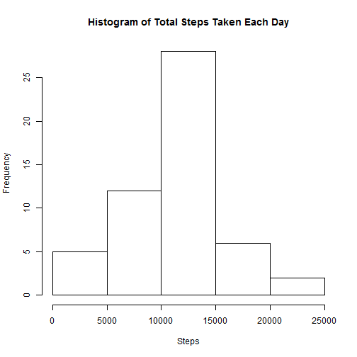
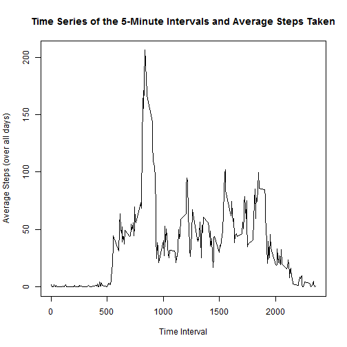
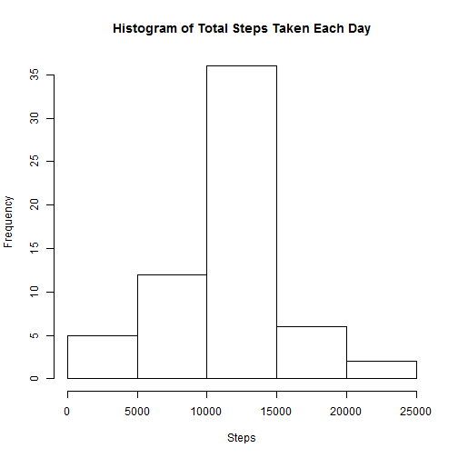
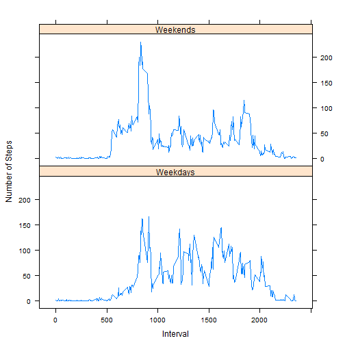

Peer Assignment 1 - Thomas Wong
========================================================

------Loading and Preprocessing the data------
----------------------------------

* We set up cached results for faster reloading:
        

```r
opts_chunk$set(cache = TRUE)
```


* We load the data here:


```r
setInternet2(TRUE)
temp <- tempfile()
download.file("https://d396qusza40orc.cloudfront.net/repdata%2Fdata%2Factivity.zip", 
    temp)
data <- read.csv(unz(temp, "activity.csv"))
unlink(temp)
```


* We transform the data here:


```r
# No transformations needed at the moment
```


------Mean Number of Steps Taken per Day------
--------------------------------------------------------------

* We plot the histogram of total steps taken each day here:


```r
sumByDate <- aggregate(. ~ data$date, data = data, sum)
hist(sumByDate$steps, main = "Histogram of Total Steps Taken Each Day", xlab = "Steps")
```

 


* We calculate the mean and median here:


```r
meanSteps = mean(sumByDate$steps)
medianSteps = median(sumByDate$steps)
```


The mean and median of the total number of steps taken each day are 1.0766 &times; 10<sup>4</sup> and 10765, respectively.

------Average Daily Activity Pattern------
--------------------------------------------------------------

* We make a time series plot of the 5 minute interval and the average steps taken:


```r
sumByInt <- aggregate(. ~ data$interval, data = data, mean)
plot(sumByInt$interval, sumByInt$steps, type = "l", main = "Time Series of the 5-Minute Intervals and Average Steps Taken", 
    xlab = "Time Interval", ylab = "Average Steps (over all days)")
```

 


* We find the 5-minute interval that contains the max number of steps:


```r
maxInt <- sumByInt$interval[which.max(sumByInt$steps)]
```


The 5-minute interval on average over all days in the dataset that contains the maximum number of steps is interval 835.

------Inputing Missing Values------
--------------------------------------------------------------

* We calculate the total number of missing values in the dataset.
We first create a boolean variable that indexes the rows with any NAs.
We then sum the variable, obtaining the total number of rows with any NAs.


```r
rowNAs <- is.na(rowSums(data[, c(1, 3)]))
numNAs <- sum(rowNAs)
```


The number of rows with any NAs is 2304.

* We create a new dataset filling in the NAs with their intervals' mean.


```r
# Add a column showing the interval average for each row of data
df <- merge(x = data, y = sumByInt, by = "interval", suffixes = c("", ".Avg"))[, 
    c(1, 2, 3, 5)]

# Reorder data frame by date like original dataset
df <- df[with(df, order(date)), ]

# replace the NA rows with the average from the new column
df$steps[rowNAs] <- df$steps.Avg[rowNAs]

# remove the extra average column
df <- df[, 1:3]

# rename the row names of the new data frame
row.names(df) <- 1:nrow(df)
```


* With the new dataset, we plot the histogram of total steps taken each day:


```r
sumByDate2 <- aggregate(. ~ df$date, data = df, sum)
hist(sumByDate2$steps, main = "Histogram of Total Steps Taken Each Day", xlab = "Steps")
```

 


* We calculate the mean and median:


```r
meanSteps2 = mean(sumByDate2$steps)
medianSteps2 = median(sumByDate2$steps)
```


Using the new dataset, the mean and median of the total number of steps taken each day are 1.0766 &times; 10<sup>4</sup> and 1.0766 &times; 10<sup>4</sup>, respectively.

Note that the mean and median for the raw dataset were 1.0766 &times; 10<sup>4</sup> and `r medianSteps2. There is almost no difference between these values, so we conclude there is little impact (at least when calculating the mean and median) by filling in the missing values with their interval means.

------Differences in Activity Patterns Between Weekdays and Weekends------
--------------------------------------------------------------

* We create a new factor variable in the dataset with 'weekday' and 'weekend' levels


```r
# Change the date column to POSIXlt format
df$date <- as.POSIXlt(df$date)

# Creates a vector that is TRUE if the date falls on a weekend
df <- cbind(df, (weekdays(df$date) == "Sunday" | weekdays(df$date) == "Saturday"))


# changes the column names
colnames(df) <- c("interval", "steps", "date", "dayType")
```


*We average the steps for weekend and weekdays.


```r
library(plyr)

df.w <- ddply(df, c("interval", "dayType"), summarize, outVal = mean(steps))
```


*We then plot the averages


```r
df.w$dayType <- as.factor(df.w$dayType)

levels(df.w$dayType <- c("Weekends", "Weekdays"))
```

```
## NULL
```

```r

library(lattice)
xyplot(outVal ~ interval | dayType, data = df.w, type = "l", layout = c(1, 2), 
    ylab = "Number of Steps", xlab = "Interval")
```

 


